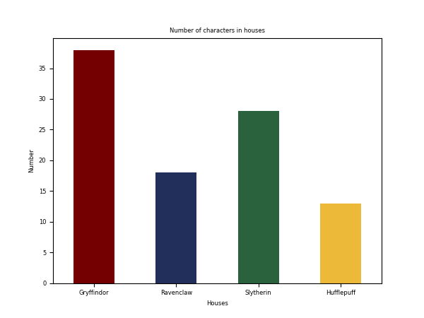
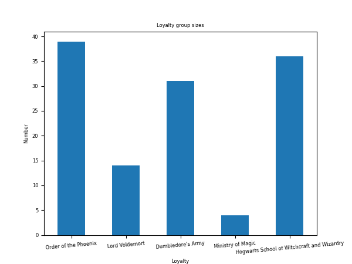
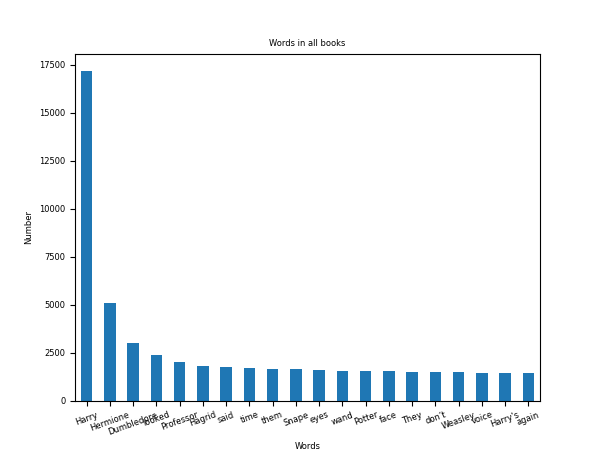
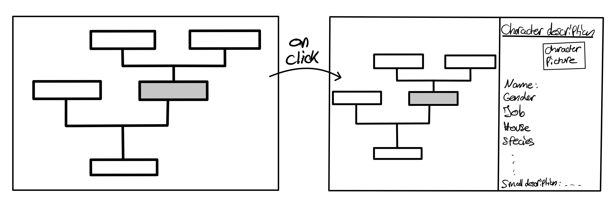
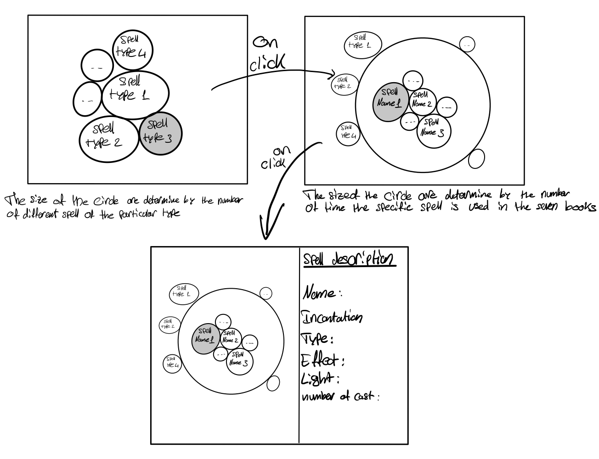
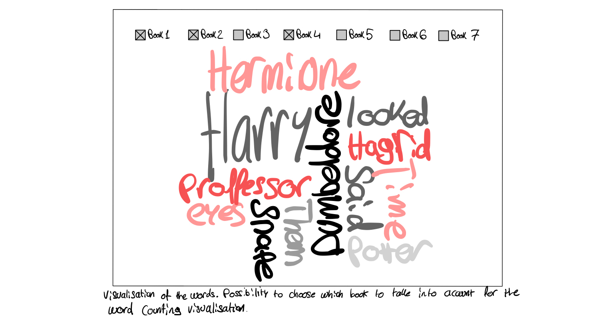

# Project of Data Visualization (COM-480) - Team MuggleData

| Student's name    | SCIPER | Email |
| ------------------| ------ |-------|
| Antoine Daeniker  | 287913 |antoine.daeniker@epfl.ch|
| David Desboeufs   | 287441 |david.desboeufs@epfl.ch|
| Jérémie Frei      | 247316 |jeremie.frei@epfl.ch|

**[Website](#https://com-480-data-visualization.github.io/datavis-project-2022-muggledata/index.html)**

[Milestone 1](#milestone-1-friday-8th-april-5pm) • [Milestone 2](#milestone-2-friday-6th-may-5pm) • [Milestone 3]

# Milestone 1 (Friday 8th April, 5pm)

The Harry Potter universe is a reference in the modern literature. Indeed, it is without a doubt one of the most famous saga ever written. After seven bestseller novels and eight blockbusters in the span of 15 years, its roots in pop culture are still very much alive. 

Its rich narratives and elaborated plots makes the whole universe difficult to grasp. This is why we came with the idea of clarifying some key properties of this masterpieces.

## Dataset

We found many datasets related to Harry Potter. Those are the main ones which we explored for now :

- <b>Characters dataset</b> : Name | Birth Date | Death Date  | Gender | House | Loyalty | Wand | Patronus | etc. 

- <b>Potions dataset</b> : Name | Known ingredients | Effect | Characteristics | Difficulty level

- <b>Spells dataset</b> : Name | Incantation | Type | Effect | Light

- <b>Books</b> : We also found all books of the saga in .txt files 

### Data quality
The data are mostly strings. For example, birth and death dates are written in string and not the conventional data type <em>datetime64</em>. Since there's only string, sometimes the information are compact into a single string and are not seperate, which add difficulties to extract the required informations. For example, we have in our character's file, a column name <em>wand</em> where the information about the size and the material of the wand are compact into a single string. This would need to be pre-process before using it (if we decide to use it).

## Problematic
Our principal topic is to create an interactive genealogy tree which represent family's link between all characters in our character dataset.

The second one is to create a visualization using the <em>Potion</em> dataset. The goal is to create links betweens the potions, the difficulties and the ingredients uses.

For the third one, we were thinking about building an interactive bubble graph using the <em>Spell</em> dataset, grouping them by spell types.

## Exploratory Data Analysis
Below, you can see some of the graphs we generated during eploratory data analysis ([Figs](Figs)) just to have an insight of our data.

## Related Work
We found a few works related to Harry Potter, the first one[4] studies the evolution of characters during the series of books by using dynamic graph network. The second one[5] concerns the words occurences toward the novel, they used Harry Potter has an example to demonstrate how MapReduce works. 

Our goal is to make data interactive, not just static images that are sometimes difficult to grasp. We want to select three topics that we will develop in depth. For example we can take the genealogy of characters, the user will be able to select a specific character to explore all his genealogical links.

The dataset choice was inspired by a visualization project done in COM-480 on The Lord of the rings[6].

## References

#### Datasets
* [1] https://data.world/harishkgarg/harry-potter-universe
* [2] https://www.kaggle.com/datasets/gulsahdemiryurek/harry-potter-dataset
* [3] https://www.kaggle.com/datasets/balabaskar/harry-potter-books-corpora-part-1-7

#### Related work
* [4] https://github.com/AlexDuvalinho/Dynamic-Graph-Networks/blob/master/report/NSA_Project_Report.pdf
* [5] https://towardsdatascience.com/understanding-mapreduce-with-the-help-of-harry-potter-5b0ae89cc88
* [6] https://com-480-data-visualization.github.io/com-480-project-bkh/

# Milestone 2 (Friday 6th May, 5pm)

## Muggle Data Website

Click [here](https://com-480-data-visualization.github.io/datavis-project-2022-muggledata/) to see our project prototype.

## Sketches

### Genealogy Visualization
For this interactive tree representation, we aim to visualize all family links of our character dataset. For each of them, we would have his parents/husband-wife/children if it exists. Moreover, we could click on one character and have a side window that contain more specific information about him. We are currently discussing if we add character that aren't included in our dataset but have link with other person of our data. For those ones, we won't be able to click on them since we don't have any informations, except for their names (and the link for our character).

### Spells Visualization
The goal of this bubble visualisation is to see which type of spell is the most common in the Harry Potter universe and which is the most used. Each spell will belong to a cell, depending on his type. The radius will depend on the number of different spell in this type categorie. And when we click on one bubble type, another bubble chart will appear. This chart contain now all different spell in this category and each of those bubble radius will depend on the number of time this particular spell is cast in all books. Finally, by clicking on one of the spell, a side window will open with the description of this particular spell and more information about it.

### Words Occurrences Visualization
Here we want to display the amount of word occurrence in books. In our sketch, obviously the size of the word will depend on the occurrence in book but we want to add more interaction about this. For this, we will add the option to select which book we want to take into account. One extra idea we could add is to use option like : select only character to display, clicking on a word and get it's exact occurrence and even its positive or negative sense using a dataset we found.

## Tools And Related Lectures

* **Vue js**: Our website is a Vue js application which simplifies the deployement and the integration of libraries. 

* **amCharts 5**: For the genealogy tree, we thought about using the amCharts 5 library that propose a nice way to build trees. We take our inspiration from the following lecture: *Graphs* (9 May - 15 May). We will also use it to create a packed circle chart to visualize the spells.

* **d3.js**: For our third visualization, we will use the d3 library for a tag cloud visualization based on the lecture *Text Viz* (2 May - 8 May). *Post scriptum*: we found out that amCharts will be easier to use for the last task.

